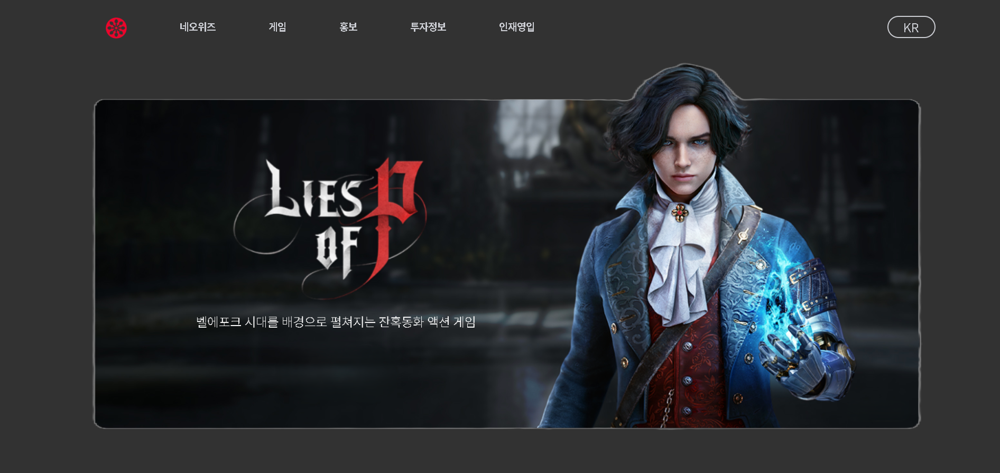

# 🐣 NEOWIZ 클론 사이트

**🚀 배포 링크**: [클론 사이트 바로가기](https://lustrous-syrniki-282361.netlify.app/)

React를 이용하여 만들어본 neowiz 클론사이트 입니다.

 
   
 

## 컴포넌트 구성

- header(헤더 컴포넌트)
- visual(무한 스크롤 관리 컴포넌트)
- news(새로운 소식을 다루는 컴포넌트)
- game(새로운 게임의 소식을 다루는 컴포넌트)
- carrers(현재 채용정보 컴포넌트)
- contact(회사내 제안 컴포넌트)
- footer(바닥글 컴포넌트)

 

## 주요 기능

- 시간에 따라 변하는 visual컴포넌트
- 각 컴포넌트별 반응형 구현
- 반응형 사이드 헤더 구현
- 무한 스크롤 game 슬라이더

 
